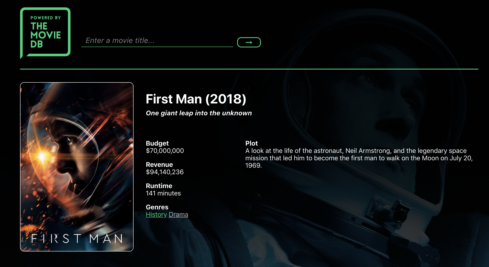
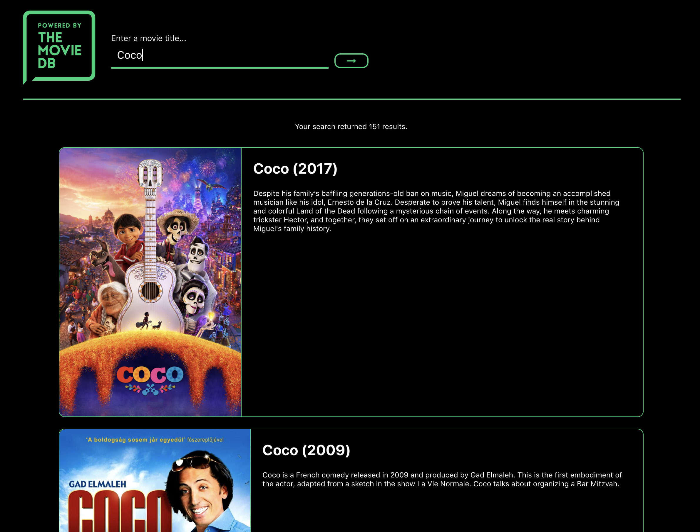
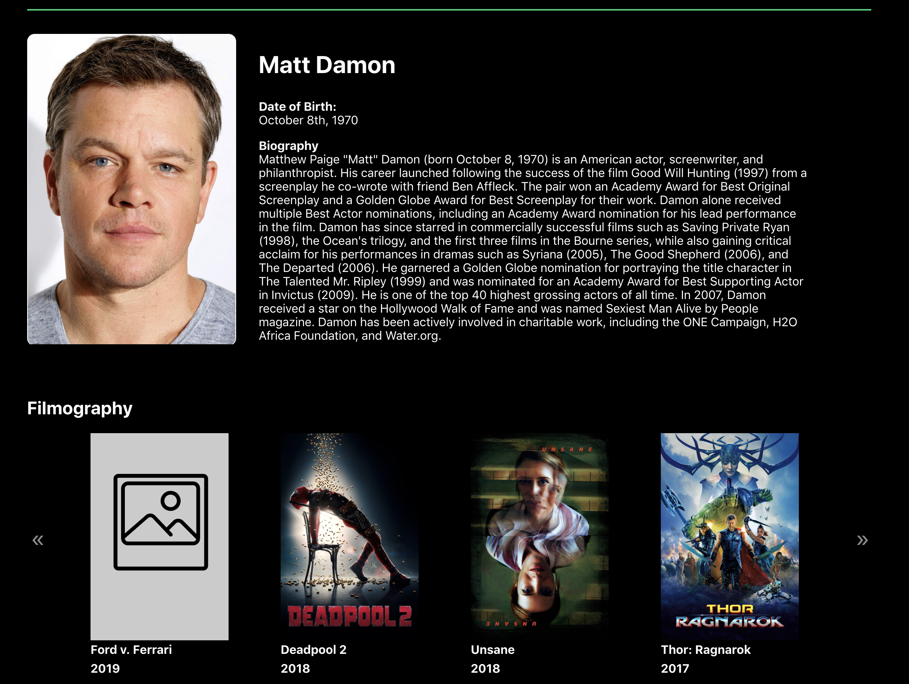

<h1>Movie Search App React</h1>

<h2>Summary</h2>

This movie search project is a refactored version of <a href="https://github.com/alexmanzo/movie-search-jquery">this project</a> using React. In addition to rebuilding the project in React, additional API calls were added to create a more robust site.

<h2>Screenshots</h2>
<h3>Movie Page</h3>
	
	
<h3>Search Results</h3>
	
<h3>Cast Profile</h3>
	

<h2>Author</h2>

This project was created by Alex Manzo.

